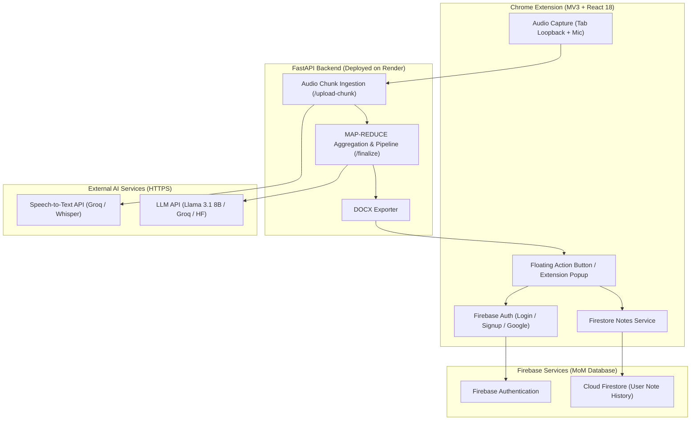

# 🎙️ NoteCraft AI

<p align="center">
  
  
  
  
  
  
</p>

NoteCraft AI is an intelligent Chrome extension and Python FastAPI backend system designed to capture live audio from online meetings (Google Meet, webinars, online classes), transcribe speech using external AI Speech-to-Text (STT) APIs, synthesize structured notes using Large Language Models (LLM), and persist user note histories securely using Firebase Authentication and Firestore.

---

## 🌟 Key Features

### 📋 MOM Mode (Minutes of Meeting)
Tailored for business, office, and team meetings. Automatically extracts key discussion points, decision items, action items with assigned owners, deadlined tasks, and executive summaries formatted into professional Minutes of Meeting (MOM).

### 📚 Class / Webinar Notes Mode
Designed specifically for technical classes, programming lectures (e.g. Java, Python, Web Development), webinars, and educational sessions. Instead of corporate meeting minutes, it synthesizes:
- Topic overviews and core concepts
- Technical explanations & code snippet walkthroughs
- Key takeaways & student Q&A highlights
- Learning resources and action steps

### 🔐 Firebase Authentication
Provides complete user authentication and account management:
- Email & Password Registration / Login
- One-tap Google Sign-In
- Secure session persistence across extension reloads
- Authenticated user state management

### 📜 Note History & Cloud Persistence
Integrates directly with Firebase Firestore (`MoM Database`) to maintain user note history:
- Automatic saving of generated notes to the user's document path (`users/{userId}/notes/{noteId}`)
- Dedicated **"My Notes"** tab in the Chrome extension UI
- View, review, and delete historical notes
- Export saved notes to DOCX format at any time

---

## 🏗️ System Architecture



---

## 📂 Project Structure

```
NoteCraft_Generator/
├── backend/                         # FastAPI Backend Application (Deployed on Render)
│   ├── routers/                     # API Routers
│   │   ├── chunks.py                # POST /upload-chunk (Audio chunk receiver)
│   │   ├── finalize.py              # POST /finalize (MAP-REDUCE & Note pipeline)
│   │   └── status.py                # GET /status, GET /download, GET /outputs
│   ├── services/                    # Business Logic & Integrations
│   │   ├── export.py                # DOCX document exporter
│   │   ├── llm_client.py            # External LLM HTTP API client
│   │   ├── metrics_logger.py        # Execution timing & compression metrics
│   │   ├── speaker_map.py           # Speaker diarization & timeline mapping
│   │   └── stt_client.py            # External Speech-to-Text HTTP API client
│   ├── session/                     # Session Management
│   │   └── store.py                 # In-memory session store & chunk buffer
│   ├── models.py                    # Pydantic API data models
│   ├── main.py                      # FastAPI app entrypoint & middleware
│   ├── run.py                       # Local development server launcher
│   ├── requirements.txt             # Python dependencies
│   └── Dockerfile                   # Production Docker container setup
│
├── extension-react/                 # Chrome Extension Frontend (React 18 + Vite)
│   ├── public/
│   │   └── manifest.json            # Manifest V3 extension configuration
│   ├── src/
│   │   ├── components/              # React UI Components
│   │   │   ├── HistoryList.jsx      # Note history list tab component
│   │   │   ├── Login.jsx            # User login component
│   │   │   ├── NoteDetail.jsx       # Detailed note preview component
│   │   │   └── Signup.jsx           # User registration component
│   │   ├── context/
│   │   │   └── AuthContext.jsx      # Firebase Auth state provider
│   │   ├── services/
│   │   │   └── notesHistory.js      # Firestore Note History CRUD service
│   │   ├── styles/
│   │   │   └── global.css           # Styling rules
│   │   ├── utils/
│   │   │   └── authErrors.js        # Auth error message formatter
│   │   ├── App.jsx                  # Main React application component
│   │   ├── firebase.js              # Firebase SDK initialization
│   │   └── main.jsx                 # React DOM root renderer
│   ├── background.js                # MV3 Background Service Worker (API proxy)
│   ├── config.js                    # Extension configuration (Backend URL)
│   ├── content.jsx                  # Content script injected into meeting pages
│   ├── offscreen.js                 # Audio recording offscreen document worker
│   ├── offscreen.html               # Audio recording container
│   ├── firestore.rules              # Firestore Security Rules definition
│   ├── package.json                 # Frontend dependencies & build scripts
│   └── vite.config.js               # Vite build configuration
│
├── render.yaml                      # Render Blueprint deployment definition
├── .gitignore                       # Git ignore rules
└── Readme.md                        # Root project documentation
```

---

## 🛠️ Technology Stack

| Layer | Technology | Function |
| :--- | :--- | :--- |
| **Frontend** | React 18, Vite | Chrome Extension (Manifest V3) user interface |
| **Icons & Styling** | Lucide React, Vanilla CSS | UI icons and custom responsive theme |
| **Backend** | Python 3.11, FastAPI, Uvicorn | CPU-only REST API server |
| **Database & Auth** | Firebase Auth, Firestore | User authentication and cloud note history |
| **Hosting** | Render | Managed Cloud Backend Web Service |
| **STT Engine** | External HTTPS API (Groq / Whisper) | Speech-to-Text audio transcription |
| **LLM Engine** | External HTTPS API (Llama 3.1 8B / HF) | Intelligence summarization and note generation |
| **Document Export** | `python-docx` | Formatted DOCX Word document synthesis |

---

## 🔄 How It Works

### Note Generation Flow

```
Google Meet Call / Webinar
    │
    ▼
NoteCraft Chrome Extension
    │
    ├── Select Mode: [ MOM Mode ] or [ Class / Webinar Mode ]
    │
    ▼
Record Audio (30-second chunking)
    │
    ▼
FastAPI Backend (Render) ───► STT API (Audio → Text Transcripts)
    │
    ▼
MAP-REDUCE Summarization ───► LLM API (Structured Note Generation)
    │
    ▼
Export DOCX & Persist Note to Firebase Firestore
    │
    ▼
Download Notes / View in "My Notes" History Tab
```

### Authentication Flow

```
User
 │
 ├── Email/Password Login OR Google Sign-In
 │
 ▼
Firebase Authentication (MoM Database)
 │
 ▼
Authenticated Extension Context
 │
 ├── Full access to Floating Record Widget
 └── Idempotent read/write access to user's Firestore Note History
```

---

## ⚙️ Environment Variables

### Frontend (`extension-react/.env`)

Create `extension-react/.env` based on `extension-react/.env.example`. **Do not commit `.env` to Git.**

```env
VITE_FIREBASE_API_KEY=your_firebase_api_key
VITE_FIREBASE_AUTH_DOMAIN=your_project.firebaseapp.com
VITE_FIREBASE_PROJECT_ID=your_project_id
VITE_FIREBASE_STORAGE_BUCKET=your_project.firebasestorage.app
VITE_FIREBASE_MESSAGING_SENDER_ID=your_messaging_sender_id
VITE_FIREBASE_APP_ID=your_app_id
```

### Backend (`backend/.env`)

Create `backend/.env` based on `backend/.env.example`.

```env
ALLOWED_ORIGINS=*

STT_PROVIDER=groq
STT_API_URL=https://api.groq.com/openai/v1/audio/transcriptions
STT_API_KEY=your_stt_provider_api_key
STT_MODEL=whisper-large-v3-turbo
STT_TIMEOUT=120

LLM_PROVIDER=huggingface
LLM_API_URL=https://router.huggingface.co/v1/chat/completions
LLM_API_KEY=your_llm_provider_api_key
LLM_MODEL=meta-llama/Llama-3.1-8B-Instruct
LLM_TIMEOUT=300
```

---

## 💻 Local Setup & Development

### Prerequisites
- **Node.js**: v18+
- **Python**: v3.11+
- **Google Chrome**: Latest version

### 1. Frontend Setup (Chrome Extension)

```bash
# Navigate to extension directory
cd extension-react

# Install dependencies
npm install

# Create local environment configuration
cp .env.example .env

# Fill in your Firebase configuration in .env, then build the extension
npm run build
```

### 2. Backend Setup (FastAPI)

```bash
# Navigate to backend directory
cd backend

# Install Python dependencies
pip install -r requirements.txt

# Create environment file
cp .env.example .env

# Fill in your STT & LLM API keys in .env, then start the server
python run.py
```
The backend server starts locally on `http://127.0.0.1:8000`. Verify health at `http://127.0.0.1:8000/health`.

### 3. Load Extension into Chrome

1. Open Chrome and navigate to `chrome://extensions`.
2. Toggle **Developer mode** in the top right corner.
3. Click **Load unpacked**.
4. Select the build output directory: `extension-react/dist`.

---

## ☁️ Backend Deployment (Render)

The backend is configured for deployment on **Render** using the provided `render.yaml` blueprint:

1. Connect your GitHub repository to [Render](https://render.com).
2. Create a new **Web Service** pointing to the repository.
3. Set Build Command: `pip install -r backend/requirements.txt`
4. Set Start Command: `cd backend && uvicorn main:app --host 0.0.0.0 --port $PORT`
5. Add required environment variables (`STT_API_KEY`, `LLM_API_KEY`, etc.) in the Render Dashboard under **Environment**.
6. Update `extension-react/config.js` with your production Render backend URL.

---

## 🔒 Security & Data Privacy

- **User Data Isolation**: Firestore Security Rules strictly enforce that users can only read, write, create, or delete documents within their own UID path (`users/{userId}/notes/{noteId}`).
- **Secret Management**: API keys (`STT_API_KEY`, `LLM_API_KEY`) reside exclusively on the backend server/Render environment variables and are **never exposed** to the client.
- **Client Security**: Frontend configuration files use standard Vite environment variables for Firebase initialization.

### Firestore Rules Summary (`extension-react/firestore.rules`)

```javascript
rules_version = '2';
service cloud.firestore {
  match /databases/{database}/documents {
    match /users/{userId} {
      allow read, write: if request.auth != null && request.auth.uid == userId;

      match /notes/{noteId} {
        allow read, create, update, delete: if request.auth != null && request.auth.uid == userId;
      }
    }
    match /{document=**} {
      allow read, write: if false;
    }
  }
}
```

---

## 🧪 Testing & Verification

The project undergoes regular verification:

- **Frontend Bundle Verification**: Clean compilation via `npm run build` in `extension-react/`.
- **Backend Syntax & Module Check**: Python syntax validation using `py_compile` across all backend modules.
- **Authentication Manual Testing**: Email/Password and Google OAuth sign-in validation.
- **Pipeline Testing**: End-to-end verification of MOM and Class/Webinar notes generation.

---

## 📈 Current Development Status

- ✅ **Chrome Extension Interface**: React + Vite MV3 extension with floating action button and note history tabs.
- ✅ **FastAPI CPU-Only Backend**: Active deployment pipeline running on Render.
- ✅ **Dual Note Modes**: MOM Mode and Class / Webinar Notes Mode active.
- ✅ **Firebase Auth Integration**: Email/Password and Google OAuth authentication live.
- ✅ **Firestore Note History**: Idempotent cloud persistence and history view implemented.
- 🚧 **Work in Progress**: Enhancing real-time transcript preview during active recording.

---

## 📄 License

This project is open-source and available under the [MIT License](LICENSE).
